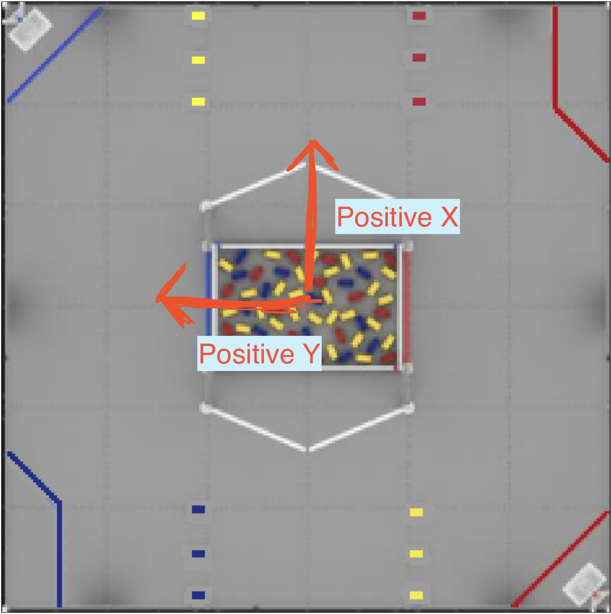

# Quickstart Guide


## Introduction

Hello and welcome to the quickstart Guide for Soar, a codebase and library designed by the 
2025 Screaming Eagles Programming team. This quickstart, similar to roadrunner, is a full
codebase consisting of every single file you need to use a robot or field relative drive and command based autonomous
with positional commands working as quickly as possible, using an FTCLib structure. 

If you'd like to use an existing codebase with this project, check out the [Soar Library Guide](LibraryGuide.md).


## Installation

!!! note
    By default, this project works under the assumption that a team is using a 3 odometry pod setup and 
    a mecanum drivetrain. While modifications can be made for teams that are using different localization options,
    it is reccomended that you stick to the above configuration for ease of use.

Simply download or clone the <a href="https://google.com" target="_blank" rel="noopener noreferrer">Quickstart</a> 
and open it an IDE of your choice.  

Alternatively, run ```git clone https://github.com/The-Founders-Academy/IntoTheDeep2025Fork``` in a terminal window. 

## MecanumConfigs Constants


To make sure that this codebase works with every type of robot, some information must be provided in the ```MecanumDrive``` and 
```MecanumConstants``` files. 

### Wheel Positions

First, open the ```MecanumConfigs``` file at the path ```TeamCode/src/main/java/org/firstinspires/ftc/teamcode/shared/mecanum/MecanumConfigs.java```

At the top of the file you will see:
```java 
    private Translation2d m_frontLeftPositionMeters = new Translation2d(0.178, 0.168);
    private Translation2d m_frontRightPositionMeters = new Translation2d(0.178, -0.168);
    private Translation2d m_backLeftPositionMeters = new Translation2d(-0.178, 0.168);
    private Translation2d m_backRightPositionMeters = new Translation2d(-0.178, -0.168);
```

Replace the values above with the correct meter values in (y, x) coordinates. 
Measure out from the centerpoint of your robot to calculate, 
ensuring your result is in meters.


```Note the flipped direction of the robot, and how it will impact the coordinates ```

### Empirical Constants

You will then need to provide values for:
```java
 private double m_maxRobotSpeedMps = 2.5;
 private double m_maxRobotRotationRps = 6.28;
 private double m_metersPerTick = 0.00056; 
```
These are determined through testing. In the ```current/tuning``` directory of the quickstart, find ```forwardDriveTest```. 
This will run all 4 wheels at 100% power. Make sure that they are named correctly in your driver station 
configuration, then hit start and record the time it takes to travel a set distance. Then divide the distance 
travelled by total time to get the max robot speed.


Do the same for rotation using the ```rotationalTest``` located in the same directory. Record the test over
a set amount of time and divide the amount of total rotations completed by the time to get the max
rotation speed

!!! note
    These values give you the maximum value you should set for the speed and rotation constants,
    not necessarily the ideal value. For our 2024-25 season robot, our m_maxRobotSpeedMps value was around 3.2, 
    however setting it to 2.5 gave our driver much more control and worked better for grabbing and
    scoring game pieces.

The ```m_metersPerTick``` value can be easily set through a formula. To set it through a formula,
find your odometry pod wheel's resolution and radius in meters via the product page, then use the:

 ```2pi * radius * resolution = meters per tick```

formula to get your value. 

Finally, ensure that all of your drive motors are following this naming convention
in your driverstation config file:

```java
    private String m_frontLeftName = "fL";
    private String m_frontRightName = "fR";
    private String m_backLeftName = "bL";
    private String m_backRightName = "bR";
```


## MecanumDrive Constants

### Odometry Pod Configuration

Next, open the ```MecanumDrive``` file, and find: 

```java
    // Mecanum Constants
    public double deadWheelRadiusCentimeters = 2.4;
    public double ticksPerRevolution = 2000.0;
    
    public double trackWidthCentimeters = 36.3;
    double perpendicularOffsetCentimeters = 20.32;
```

Set ```deadWheelRadiusCentimeters``` and ```ticksPerRevolution``` as per the product page
of your odometry pods that you found earlier. Make sure that your deadwheel radius is in
centimeters. 


Then, measure the distance betewen your parallel odometry pods to find ```trackWidthCentimeters```
and the distance from the center point where your parallel odometry pods meet to the center
of your perpendicular odometry pod to find ```perpendicularOffsetCentimeters```.
All your values should be positive. 


### Assigning Motor RPM

Finally, at the top of the MecanumDrive constructor, find:

```java
     m_frontLeft = new MotorEx(hardwareMap, m_mecanumConfigs.getFrontLeftName(), Motor.GoBILDA.RPM_312);
     m_frontRight = new MotorEx(hardwareMap, m_mecanumConfigs.getFrontRightName(), Motor.GoBILDA.RPM_312);
     m_backLeft = new MotorEx(hardwareMap, m_mecanumConfigs.getBackLeftName(), Motor.GoBILDA.RPM_312);
     m_backRight = new MotorEx(hardwareMap, m_mecanumConfigs.getBackRightName(), Motor.GoBILDA.RPM_312);
```

and replace ```Motor.GoBILDA.RPM_312``` with the RPM of your drive motors. 

## Tuning PIDs

### Translation Controller 

To start connect to your robot's WiFi network, then open FTCDashboard via the link ```192.168.43.1:8080/dash``` or 
```192.168.49.1:8080/dash``` if you use a phone as a robot controller. 

This will allow you to update the PID values live and see changes immediately without restarting the OpMode, which greatly
helps with tuning. 

Once on FTCDashboard, find the ```tuning``` directory and open the ```TranslationControllerTest``` file. By default, this will
have the robot go 100cm forward when clicking ```a```, and back to the zero position when clicking ```b```.

On FTCDashboard, you should see ```Current Position``` and ```Target Position``` in the telemetry section in the bottom right.
You should see the current position moving between about 100 and 0, as you hit the ```a``` and ```b``` buttons. 

If your current position is undershooting the target position, try slightly increasing the ```Translation P``` value in 
FTCDashboard. You'll find it in the top right, under the ```BaseMecanumParams``` dropdown. Changing the value and hitting enter will
update the value. If you are overshooting, try slightly decreasing the ```Translation P``` value. 

Once you have found the ideal value, go to the ```MecanumDrive``` file again, and find the ```Translation P``` and 
```Translation I``` values, and replace them with the values that you got from FTCDashboard. 

!!! Note
    We use a ```Translation P``` value and a ```Translation I``` value. ```Translation I``` adds some extra stopping force
    to the movement. if you find it's not correcting enough as it reaches the position, try slightly increasing ```Translation I```.
    If you notice weird jerky movements while the robot reaches a position, slightly decrease ```Translation I```. 

### Rotation Controller

Once you have a reasonably accurate translation controller, open the ```RotationControllerTest``` file, and open FTCDashboard.
This is similar to the Translation Controller test, but hitting the ```a``` and ```b``` buttons will rotate the robot between
0 and 180 degrees, instead of moving it. Once again, if your rotation is overshooting reduce ```Rotation P```, if it is 
undershooting increase it.

Again adjust ```Rotation I``` as needed, decreasing if movements are overly jerky at the end, 
and increasing if it doesn't have enough "kick" or power to go to exactly 180 degrees. Then enter the values you end up with
in the ```MecanumDrive``` file. 


## Teleop Features

Congratulations! Your robot should now be fully tuned. Now we can add functionality. 

### CommandDrive
To start, run the ```CommandDrive``` file on the robot, and test the Drive. 
It should be a fully functional field relative drive. If it is, you can move on. If not, try checking the MecanumConstants 
you inputted in the above steps, you may have missed a value or need to refine values. 

### Commands

Open the ```CommandDriveAndArm2025``` file. This file is similar to the ```CommandDrive``` file, but adds in commands that the
driver and operator can press to call. 

```java
// Driver Commands
m_driver.buttonA().whenPressed(new InstantCommand(() -> m_mecanumDrive.resetHeading()));

// Operator Commands
m_operator.buttonA().whenPressed(new ArmCommand(armSubsystem, liftSubsystem, ArmCommand.ArmPosition.ARM_COLLECT));
m_operator.buttonB().whenPressed(new ArmCommand(armSubsystem, liftSubsystem, ArmCommand.ArmPosition.ARM_CLEAR_BARRIER));
m_operator.buttonX().whenPressed(new ArmCommand(armSubsystem, liftSubsystem, ArmCommand.ArmPosition.ARM_SCORE_SAMPLE_IN_LOW));

m_driver.leftBumper().whenPressed((new IntakeCommand(armSubsystem, IntakeCommand.IntakeSetting.INTAKE_COLLECT)));
m_driver.rightBumper().whenPressed(new IntakeCommand(armSubsystem, IntakeCommand.IntakeSetting.INTAKE_DEPSOSIT));

m_operator.dpadUp().whenPressed(new ArmCommand(armSubsystem, liftSubsystem, ArmCommand.ArmPosition.ARM_SCORE_SPECIMEN));
m_operator.dpadDown().whenPressed(new ArmCommand(armSubsystem, liftSubsystem, ArmCommand.ArmPosition.ARM_COLLAPSED_INTO_ROBOT));
m_operator.buttonY().whenPressed(new IntakeCommand(armSubsystem, IntakeCommand.IntakeSetting.INTAKE_OFF));

m_operator.leftBumper().whenPressed(new ArmCommand(armSubsystem, liftSubsystem, ArmCommand.ArmPosition.LEFT_BUMPER_PRESSED, m_operator));
m_operator.rightBumper().whenPressed(new ArmCommand(armSubsystem, liftSubsystem, ArmCommand.ArmPosition.RIGHT_BUMPER_PRESSED, m_operator));
```

These Commands are located in 3 files, ```ArmCommand```, ```WristCommand```, and ```IntakeCommand```.
We have left in all the commands used in the 2024-25 season, as they may be able to be reused in future seasons, but it is 
easy to create and use new custom commands for each season. 

### Adding Custom Commands

Our commands follow a:

<h2>opmode -> command -> subsystem</h2>

pipeline. The opmode calls a command, which then calls a function to be executed in the subsystem. We do actions in subsystems
for better abstraction, and because the subsystems already have access to all the hardware on the robot. It reduces the amount
of code we have to write.


#### Example of full Arm Command Structure:

OpMode:
```java
m_operator.buttonX().whenPressed(new ArmCommand(armSubsystem, liftSubsystem, ArmCommand.ArmPosition.ARM_SCORE_SAMPLE_IN_LOW));
```

This calls the command ```ArmCommand```, the second layer in the opmode -> command -> subsytem process.

ArmCommand:
```java
case ARM_SCORE_SAMPLE_IN_LOW:
    m_armSubsystem.setArmPosition(m_armSubsystem.getARM_SCORE_SAMPLE_IN_LOW());
    m_armSubsystem.setWristPosition(m_armSubsystem.getWRIST_FOLDED_OUT());
    break;
```

This is just one part of ```ArmCommand```, set by a switch statement with the case passed in above in the OpMode. This now calls
two functions in ```m_armSubsystem```, ```setArmPosition``` and ```setWristPosition```. 

ArmSubsystem functions:

```java
public void setWristPosition(double wristPosition) {
    wrist.setPosition(wristPosition);
}
    
...
    
public void setArmPosition(double armPosition) {
armMotor.setTargetPosition((int) (armPosition));

((DcMotorEx) armMotor).setVelocity(2100);
armMotor.setMode(DcMotor.RunMode.RUN_TO_POSITION);

    }
```

!!!Note
    These functions are the final layer in this process, and actually set the motor speeds. It's useful to seperate things in this way,
    as it allows you to call commands in parallel, organize things better, and avoid writing redundant code. The motor objects now do not
    have to be seperately defined within the commands, only the sbusystems, the commands simply call the subsystem functions. 


## Autonomous Features

Soar's autonomous allows you to call ```DriveToPosition``` commands. These commands will drive to a given position on a coordinate plane,
relative to a starting position (in coordinates), that you pass into the autonomous. 

Our coordinate plane is in ```cm```, with a center point (0, 0), directly in the middle.
The width of the field is 365.76cm, meaning the radius of the field is 182.88cm. Positive rotation is 
counterclockwise, with 0 and 360 degrees being in the direction of the Positive X arrow. 



We have also made a website (which will be updated every year), showcasing the coordinate
system which adjusts coordinates based on where you move your mouse. This can be useful
in determining your autonomous pathing. 

<a href="https://screamingeagles2025.netlify.app" target="_blank" rel="noopener noreferrer">Coordinate Website</a> 


### Example Autonomous Program:

Under the ```Autos``` folder in teamcode, open the ```BlueSampleAuto``` file. If you want to make your own autonomous programs,
copy the file, and change this line:

```java
 m_mecanumDrive = new Mecanum2025(hardwareMap, mecanumConfigs, new Pose2d(76.6, 159.3, Rotation2d.fromDegrees(270)), BaseMecanumDrive.Alliance.BLUE); // y was 159.3
```

And change the `Pose2d` to the coordinates where your robot will start in the autonomous program, using the coordinate website or measuring yourself
from ```(0, 0)```. 

Then this line:

```java
        CommandScheduler.getInstance().schedule(  new BlueSampleCommandRunner(m_mecanumDrive, m_armSubsystem, m_liftSubsystem));
```

calls the command ```BlueSampleCommandRunner```. Opening this file which is in the ```Commands``` folder, we see:

an ```addCommands()``` line, with many commands in it. 

This is the general format of how to write an autonomous with driveToPosition commands. 

```java   
new DriveToPosition(m_mecanumDrive, new Pose2d(110, 115, Rotation2d.fromDegrees(215))).withTimeout(200),
```
This will drive to the coordinate 110, 115, with a rotation of 215 degrees. Notice the ```withTimeout(200)``` at the end.
This marks when to cancel the command, in milliseconds.

You can also run commands in parallel, using this syntax:

```java
new ParallelCommandGroup(
    new ArmCommand(m_armSubsystem, ArmCommand.ArmPosition.ARM_SCORE_SAMPLE_IN_LOW).withTimeout(1500),
    new DriveToPosition(m_mecanumDrive, new Pose2d(124, 124, Rotation2d.fromDegrees(217))).withTimeout(2700)
),
```

This runs both the ```ArmCommand``` and ```DriveToPosition``` command, and they each end when their respective timeOut is called.
You can use this simple structure to easily create advanced autonomous programs. It allows for easy duplication of commands, and
is more robust than simply driving a direction for a set amount of time, as this now automatically has error control. 

### Teleop Commands

Similarly, you can add commands to your teleop program, accessable by a button press on a controller. You would simply
call the commands in your opmode, with the following syntax:

CommandDriveAndArm2025:

```java
  // Driver Commands
  m_driver.buttonA().whenPressed(new InstantCommand(() -> m_mecanumDrive.resetHeading()));


  // Operator Commands
  m_operator.buttonA().whenPressed(new ArmCommand(armSubsystem, liftSubsystem, ArmCommand.ArmPosition.ARM_COLLECT));
  m_operator.buttonB().whenPressed(new ArmCommand(armSubsystem, liftSubsystem, ArmCommand.ArmPosition.ARM_CLEAR_BARRIER));
  m_operator.buttonX().whenPressed(new ArmCommand(armSubsystem, liftSubsystem, ArmCommand.ArmPosition.ARM_SCORE_SAMPLE_IN_LOW));
```
!!!Note
    You should keep the Driver ```resetHeading()``` command, as that when pressed will reset the "forward" direction to wherever
    the robot is looking when pressed. This ensures the robot heading won't drift over time, and makes testing easier. 

## End

Congratulations! You should now have a working field relative drive, Autonomous ```DriveToPosition``` commands
through a coordinate system, and the ability to create custom commands for both autonomous and teleop. 